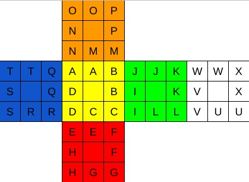

# 🎯 Blind Cube - Rubik's Cube Simulator & Blind Solving Trainer

[](https://bld-cube.thomasbale.com)
[](https://github.com/TumCucTom/blind-cube/issues)

A comprehensive Rubik's Cube simulator with advanced blind solving capabilities, designed to help speedcubers practice and improve their blind solving skills.

## 🚀 Live Demo

**🌐 Visit the live application:** [https://bld-cube.thomasbale.com](https://bld-cube.thomasbale.com)

## 📸 Demo Screenshots

### Main Interface


### Blind Solving Mode
- **Cube Hidden**: The cube is completely covered during blind solving practice
- **Letter Input System**: Type letters A-X to execute setup moves
- **Mode Toggle**: Switch between edge and corner solving modes
- **Real-time Feedback**: See setup moves as you type

## ✨ Features

### 🎲 Core Cube Functionality
- **Interactive 3D Cube**: Powered by AnimCube3.js
- **Custom Scrambles**: Enter your own scramble sequences
- **Random Scrambles**: Generate random 20-move scrambles
- **Mouse/Touch Controls**: Click and drag to rotate, click faces for moves
- **Keyboard Shortcuts**: Quick access to common functions

### 🕶️ Blind Solving Features
- **Blind Mode Toggle**: Hide the cube during practice
- **Letter Input System**: Type letters A-X for setup moves
- **Edge/Corner Modes**: Practice different solving phases
- **Setup Move Display**: See the moves for each letter in real-time
- **Undo Functionality**: Reverse setup moves with one click
- **Buffer Piece Recognition**: Automatic detection of buffer pieces

### 🔄 Algorithm Practice
- **T Perm**: Edge permutation algorithm
- **Y Perm**: Corner permutation algorithm (Old Pochmann method)
- **Full Parity**: Complete parity algorithm
- **One-Click Execution**: Apply algorithms to current cube state

### 🎯 Learning Tools
- **Example Scrambles**: Pre-built common patterns
- **Move History**: Track executed setup moves
- **Visual Feedback**: Clear indication of current mode and moves
- **Error Prevention**: Invalid letter detection and buffer piece warnings

## 🛠️ Technical Stack

- **Frontend**: Pure HTML, CSS, JavaScript
- **Cube Engine**: [AnimCube3.js](https://github.com/muodov/kociemba)
- **Deployment**: [Vercel](https://vercel.com)
- **Domain**: Custom domain via Vercel
- **Issue Tracking**: GitHub Issues with VibeOps integration

## 🚀 Quick Start

1. **Clone the repository**
   ```bash
   git clone https://github.com/TumCucTom/blind-cube.git
   cd blind-cube
   ```

2. **Open in browser**
   ```bash
   open index.html
   ```
   Or simply double-click `index.html` to open in your default browser.

3. **Start practicing!**
   - Use the scramble controls to set up the cube
   - Toggle blind mode to hide the cube
   - Type letters A-X to practice setup moves

## 📚 Documentation

### 🕶️ Blind Solving Guide
For detailed information about blind solving techniques, setup moves, and how to use the blind solving features, see:
**[📖 Blind Solving Documentation](docs/blind-solving-guide.md)**

### 🎓 Learning Features
The project includes comprehensive learning functionality:
- Setup move tutorials and practice
- Algorithm recognition training
- Performance tracking and analytics
- Gamification elements

## 🌐 Deployment

### Production Deployment
- **Platform**: Vercel
- **URL**: https://bld-cube.thomasbale.com
- **Custom Domain**: Configured via Vercel DNS
- **Auto-deploy**: Connected to GitHub repository

### Deployment Process
1. Push changes to main branch
2. Vercel automatically builds and deploys
3. Custom domain automatically updates
4. SSL certificate automatically provisioned

## 🐛 Issue Tracking & Development

### VibeOps Integration
This project uses VibeOps for issue tracking and project management:
- **Issue Creation**: Automated via GitHub CLI
- **Feature Requests**: Tracked with detailed specifications
- **Development Workflow**: Integrated with GitHub Actions

### Current Development
- ✅ Core cube functionality
- ✅ Blind solving mode
- ✅ Algorithm practice
- 🔄 Learning features (in development)
- 📋 Performance analytics (planned)

## 🙏 Acknowledgments

- **AnimCube3.js**: 3D cube visualization engine
- **Vercel**: Hosting and deployment platform
- **Speedcubing Community**: For inspiration and feedback

---

**🎯 Ready to improve your blind solving skills?** [Try it now!](https://bld-cube.thomasbale.com) 